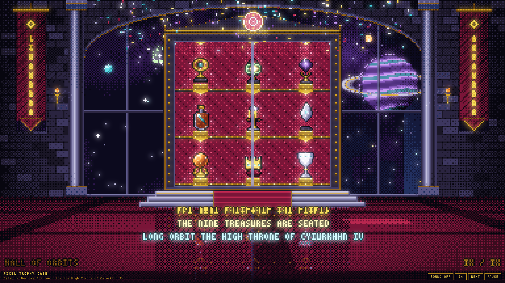
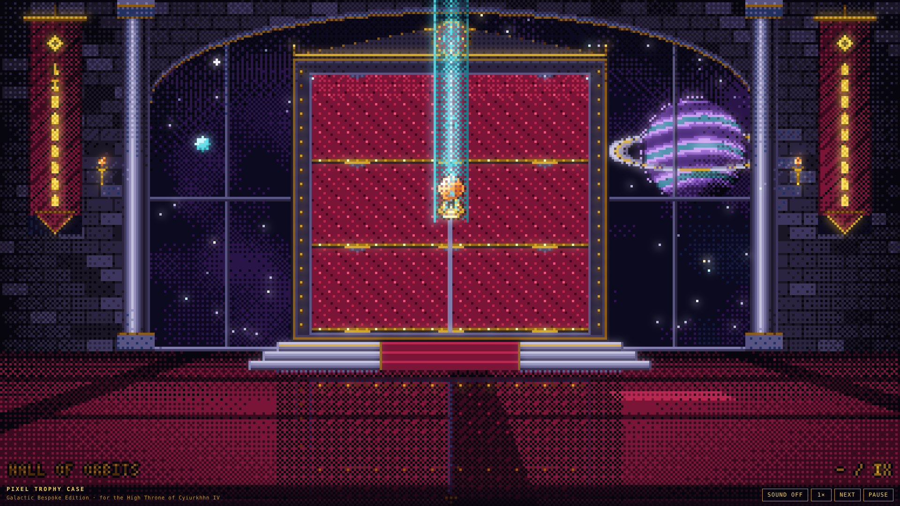
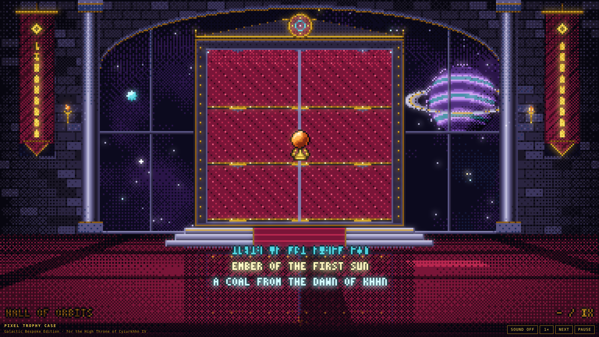
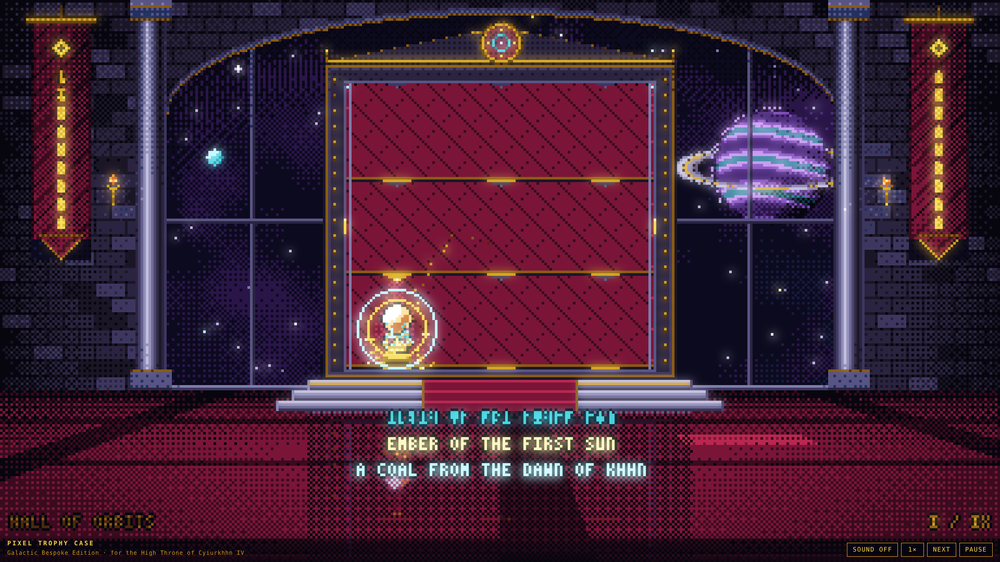
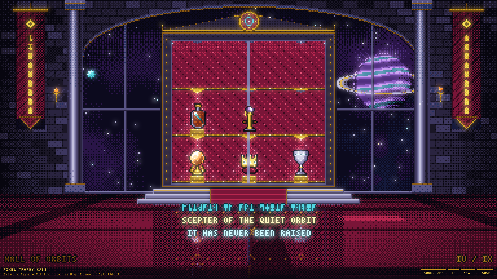
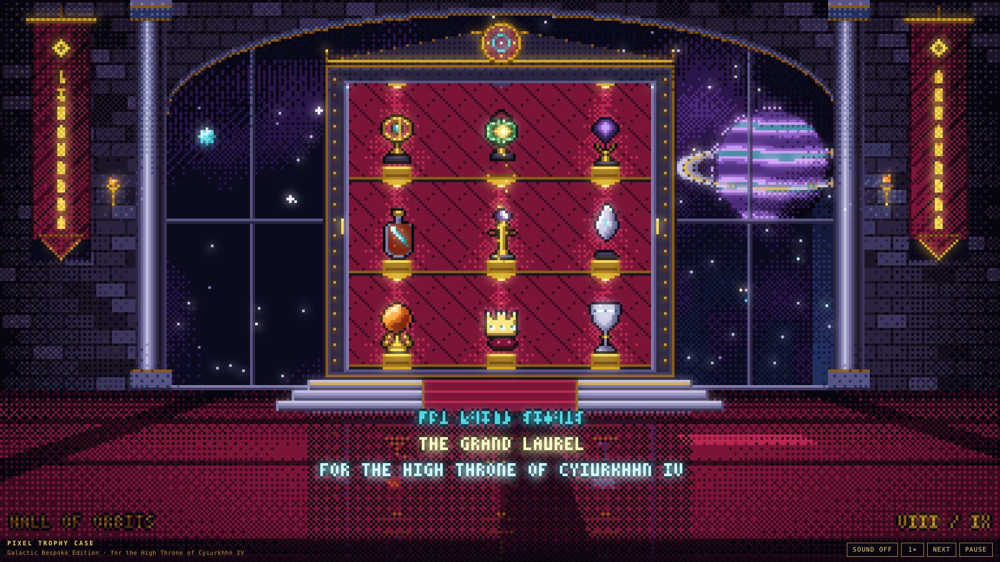
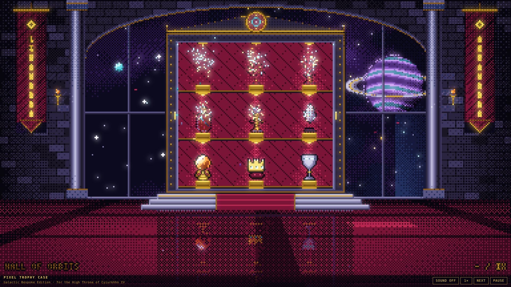

# Pixel Trophy Case — Galactic Bespoke Edition

A pixel-art investiture ceremony for the High Throne of Cyiurkhhn IV. In the Hall of Orbits, under the ringed giant
Khhn, nine treasures are summoned one by one down a transit beam, presented with their nameplates in Cyiurkhhn
script and the court's translation, seated on rising pedestals behind sliding crystal doors, and sealed in. When the
ninth is seated the hall holds its finale (fanfare, fireworks beyond the window, confetti, the pulsing royal seal),
then the collection dissolves into stardust and the orbit begins again.

Plain JavaScript ES modules on an index-colour software framebuffer (384×216, 38 fixed colours, ordered dither, no
alpha blending) presented on Canvas 2D at an integer scale, with chip-voice audio through Web Audio. No runtime
dependencies; the production build is one self-contained HTML file.



|  |  |  |
|---|---|---|
|  |  |  |

Frames are from the headless render check (`npm run screenshot`), Chromium at 1920×1080 (scale 5).

## Running it

```bash
npm install
npm run dev          # http://localhost:5173
npm run build        # dist/ plus dist/pixeltrophycase.html (single file)
npm run screenshot   # headless Chromium: drives the ceremony to nine key moments, PNGs in scripts/out/
npm test             # same, with assertions: nine seatings, finale, dissolve, loop restart, no console errors
```

Controls: **Sound** (S) · **Speed** 1×/2×/4× (1/2/3) · **Next** skips to the end of the current phase (N) · **Pause** (Space).
Sound is off until you turn it on (browsers require a gesture). The HUD hides when the pointer rests.

URL flags: `?speed=4`, `?nobloom=1`, `?headless=1` (no animation loop; `window.APP.step(n)` / `APP.stepUntil(pred)` drive it).

## The nine treasures

Seated bottom shelf first, left to right, then the middle shelf, then the top corners, with the centre of the top
shelf kept for the last.

| #  | Treasure                     | The court's inscription                    | Animation                          |
|----|------------------------------|--------------------------------------------|------------------------------------|
| 1  | Ember of the First Sun       | A coal from the dawn of Khhn               | ember pulse                        |
| 2  | Crown of the Nine Tides      | Worn by the drowned queens                 | gem glint                          |
| 3  | Chalice of Vhaal             | Never emptied. Never filled.               | inlay glow                         |
| 4  | The Comet in Amber           | Caught on its 400th return                 | two-frame tail shimmer             |
| 5  | Scepter of the Quiet Orbit   | It has never been raised                   | orbiting ring (8 frames)           |
| 6  | Shard of the Broken Moon     | All that remains of Yssir                  | levitates above its stone          |
| 7  | Astrolabe of Khhn            | It still finds home                        | spinning inner gimbal (6 frames)   |
| 8  | Heart of a Dead Star         | Cold. Still beating.                       | violet-to-crimson heartbeat        |
| 9  | The Grand Laurel             | For the High Throne of Cyiurkhhn IV        | gold flare                         |

## The ceremony

```
intro ─▶ summon ─▶ present ─▶ open ─▶ place ─▶ seal ─▶ rest ─┬─▶ summon (next treasure)
                                                              └─▶ finale ─▶ reset ─▶ intro
```

| Phase   | Length | What happens                                                                                                   |
|---------|--------|----------------------------------------------------------------------------------------------------------------|
| summon  | 1.8 s  | The transit beam opens from the ceiling; the treasure materialises (Bayer dissolve) and descends in the light. |
| present | 2.4 s  | It hovers before the case. The nameplate types out in Cyiurkhhn script, then the translation.                 |
| open    | 0.7 s  | The crystal doors slide into the stiles.                                                                       |
| place   | 1.1 s  | The treasure flies a bezier arc to its slot while the pedestal rises; landing: 5-frame hitstop, full-frame flash, shock rings, sparks, stardust, camera shake, the slot lamp lights. |
| seal    | 0.9 s  | Doors close; the royal seal pulses.                                                                            |
| finale  | 9.5 s  | Fanfare, lamp wave, fireworks over the nebula, confetti, title card.                                           |
| reset   | 3.2 s  | Doors open; each treasure dissolves into rising dust; pedestals sink; doors close.                             |

One full orbit is about 80 s at 1×.

## Rendering

* **Index framebuffer.** `src/gfx/fb.js` draws palette indices into a `Uint8Array`; `screen.js` converts to RGBA
  once per frame and blits at an integer scale with smoothing off. Lighting, flashes, glass haze, the floor
  reflection and the vignette are palette remaps (`UP`/`DN` ramp neighbours) applied with 4×4 Bayer coverage, so
  nothing is ever blended.
* **Bloom** is a half-resolution bright pass drawn to a second canvas that CSS blurs and screen-blends over the
  crisp one.
* **Sky:** two value-noise clouds quantised to violet and teal ramps, 230 twinkling stars, two moons on elliptical
  orbits, shooting stars, and the gas giant rendered per frame with rolling bands, a dithered terminator and rings
  that pass behind and in front of the disc.
* **Hall:** brick walls with per-brick seeded variation, the arched window with mullions and transom, fluted pillars,
  the throne's banners (sigil and script), torch sconces whose halos flicker on the wall, and a projective tiled
  floor with a crimson runner that fades toward the horizon. The case reflects into the floor below the dais.
* **Case:** obsidian carcass with gold trims and studs, quilted velvet, three shelves of three lamps with
  precomputed light cones, rising pedestals, sliding doors with haze and a travelling glint, pediment and seal.
* **Text:** a 3×5 Latin font and a 26-glyph Cyiurkhhn script generated once from a fixed seed (vowels are mirrored,
  consonants carry a spine), so every nameplate is in one consistent hand.
* **Determinism:** one seeded RNG (`mulberry32`) drives everything in the sim, and the loop steps a fixed 1/60 s, so
  `npm test` reaches the same frames every run.

## Sound

Chip voices only (25 % pulse via periodic wave, square, triangle, filtered noise) through a feedback delay for the
hall. Cues: summon arpeggio, nameplate blips, door slides, landing bell and thud, seal chord, finale fanfare,
firework bursts, dissolve sweep, plus a low detuned drone. The context is created on the first gesture and
suspended when the tab is hidden.

## Layout

```
src/core/     palette (38 colours, ramps, remaps), seeded RNG, easing
src/gfx/      index framebuffer + primitives + sprites, fonts, presenter and bloom
src/scene/    layout constants, sky, hall, cabinet, the nine trophies
src/fx/       particle pool (dust, sparks, confetti, fireworks, rings, rising dust)
src/anim/     director: phase machine and frame composition
src/audio/    chip synthesiser and cue table
src/ui/       HUD and styles
scripts/      inline.mjs (single-file build), screenshot.mjs (headless render check)
docs/         DESIGN.md, shots/
```

## Earlier iterations

Other branches of this repository hold the previous takes on the trophy case: a 20-stage 3D Rube Goldberg machine
(Three.js + Rapier) and *Loot Pixel Vault*, a pixel-art loot-card opener.
