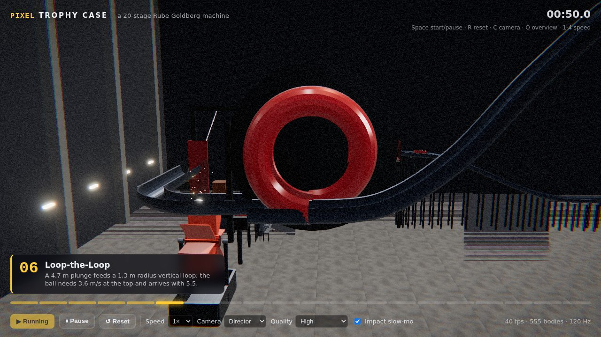
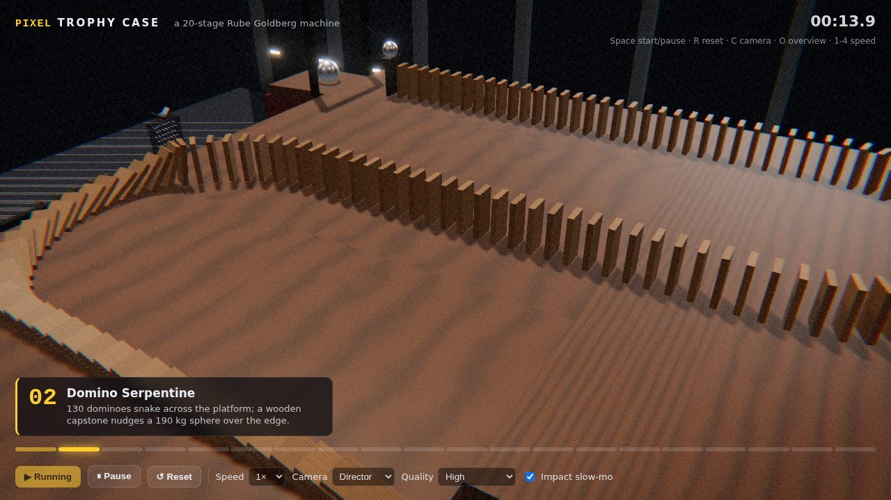
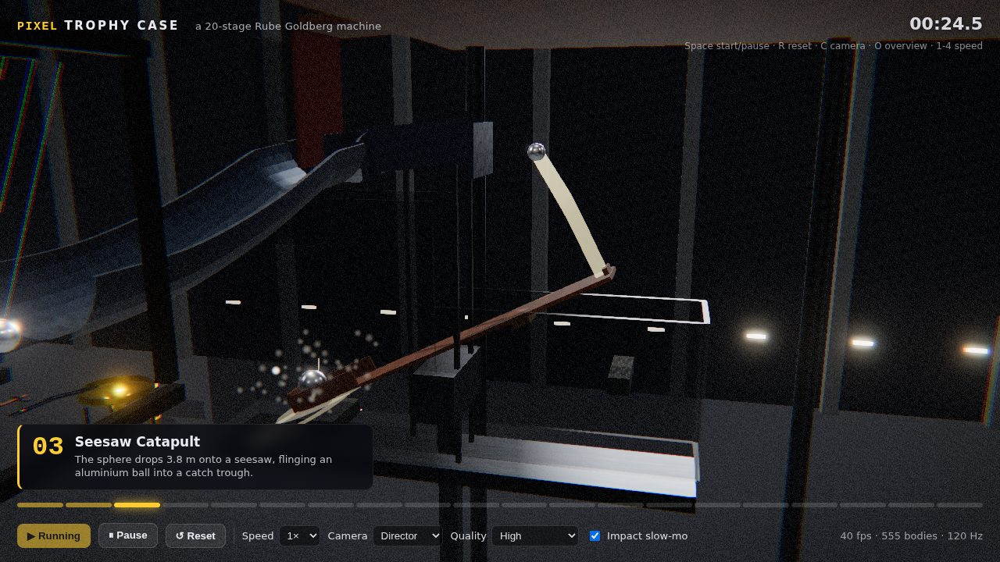
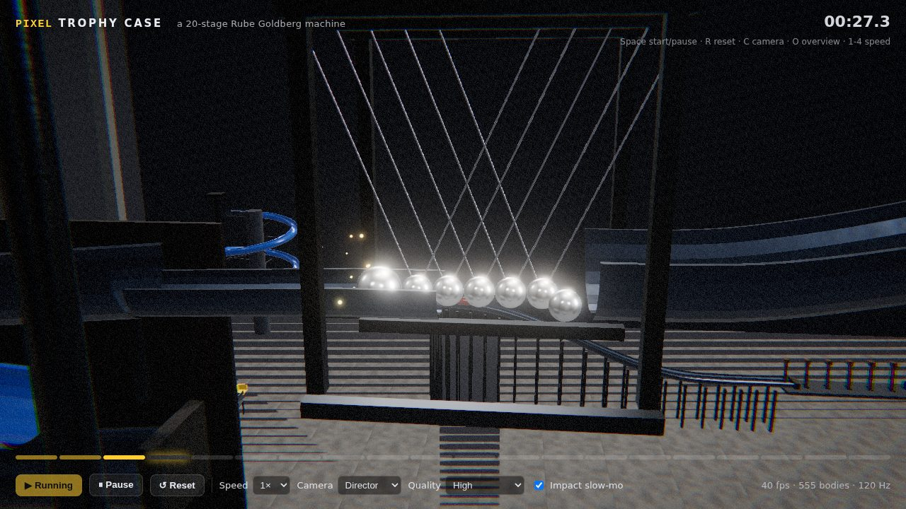
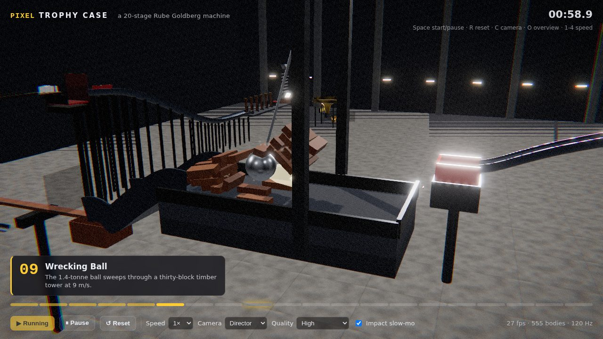
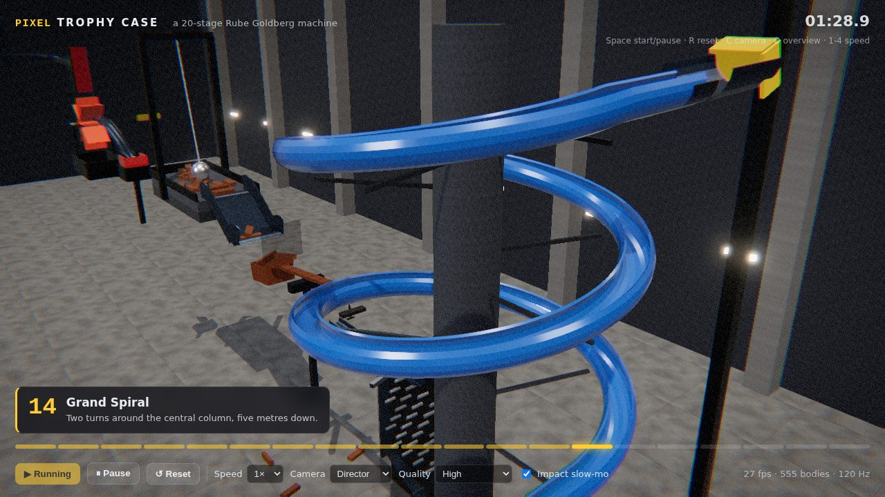
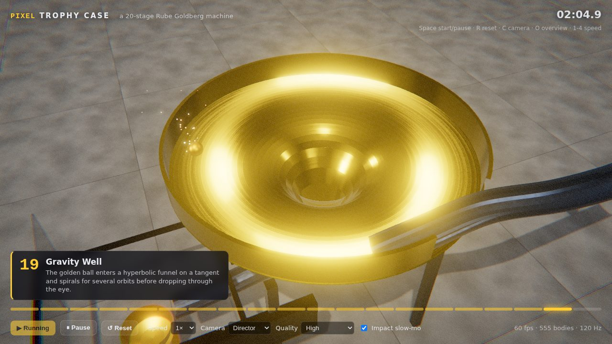
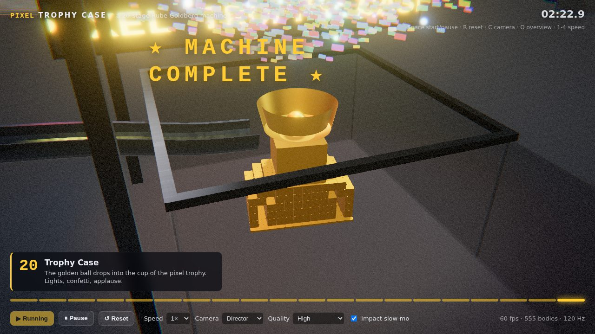

# Pixel Trophy Case

A 20-stage 3D Rube Goldberg machine that runs entirely in the browser. Every stage is driven by real rigid-body
physics (Rapier, 120 Hz fixed step, CCD, joints, motors, sensors); nothing is keyframed except the kinematic
actuators (gates, lift, conveyor flights, pedestal) that the physics itself triggers. The renderer is Three.js
with physically based materials, a post-processing stack and GPU particle VFX. The whole chain, from the first
steel sphere to the golden ball landing in the trophy cup, is verified headlessly in Node before it is ever drawn.



|  |  |  |
|---|---|---|
|  |  |  |



Frames above are from the headless render check (`npm run screenshot`), rendered by SwiftShader at the "High" quality preset.

## Running it

```bash
npm install
npm run dev          # http://localhost:5173  (Space = start, R = reset, C = orbit camera, O = overview, 1-4 = speed)
npm run build        # static bundle in dist/
npm run simulate     # headless physics run: prints when each stage is reached and the finale time (~20 s wall)
npm run screenshot   # headless Chromium render check: dist/ is served, the sim is stepped to key moments, PNGs land in scripts/out/
```

`npm test` is an alias for `npm run simulate`; it exits non-zero if any stage is not reached.

Useful flags:

```bash
node scripts/simulate.mjs --trace B,C --step 0.5      # trace named balls
node scripts/simulate.mjs --from 7                     # fire a test ball into stage 7 in isolation
node scripts/simulate.mjs --jitter 2                   # shift the whole machine by 2 mm (robustness probe)
node scripts/screenshot.mjs --times 5,50,139 --probe   # camera/occluder diagnostics per frame
node scripts/camcheck.mjs                              # static check of every stage's director camera against the geometry
```

## The 20 stages

| #  | Stage               | Mechanism                                                                                              |
|----|---------------------|--------------------------------------------------------------------------------------------------------|
| 1  | Release             | Kinematic gate drops; a 110 kg steel sphere rolls into a two-turn helix (245° pipe section).           |
| 2  | Domino Serpentine   | 130 dominoes on a platform in an exact-arc serpentine; a rope-hung 57 kg pendulum knocker nudges a 190 kg sphere off the edge. |
| 3  | Seesaw Catapult     | The sphere falls 3.8 m down a drop channel onto a seesaw; an aluminium ball is flung into a felt-backed catch trough. |
| 4  | Newton's Cradle     | Five equal-mass spheres on revolute joints pass momentum along to release the next ball.               |
| 5  | Switchback Descent  | Five stacked chutes with rubber bumpers zigzag the ball down 3.5 m.                                     |
| 6  | Loop the Loop       | A 1.3 m radius vertical loop with 0.8 m of lateral drift, exiting through a quarter turn.              |
| 7  | Paddle Wheel        | The ball drops through a shaft onto an eight-blade wheel; a rising blade flicks the next ball off its ledge. |
| 8  | Pressure Plate      | A sprung plate (force-based prismatic spring) trips a sensor that retracts the hook holding a wrecking ball. |
| 9  | Wrecking Ball       | The 1.4-tonne sphere on a 5 m rope sweeps through a thirty-block timber tower at 9 m/s.                |
| 10 | Balance Gate        | Debris pours down a chute into a bucket; the loaded beam lifts a stem-and-bar gate out of the trough.  |
| 11 | Plinko Board        | Six rows of staggered pegs between a back wall and a glass sheet, into a collector.                    |
| 12 | Flight Conveyor     | Four kinematic pusher flights loop through a slotted trough at 1 m/s.                                  |
| 13 | Lift                | A sensor in the cup starts the hoist: 13 m in nine seconds, then the cup tips 110° into the spiral.    |
| 14 | Grand Spiral        | Two turns of 2.4 m radius around a column, five metres down.                                           |
| 15 | Bowling             | Ten pins; ball and pins fall into a pit whose sprung plate releases the cart.                          |
| 16 | Rail Sled           | A 90 kg sled on PTFE runners (minimum friction combine) screams down a 4.5 m half-pipe.                |
| 17 | Hammer Chain        | Six hinged hammers topple in sequence; the last one hits a sprung red button.                          |
| 18 | Marble Cascade      | A kinematic door releases 60 steel marbles through a peg field into a bucket on a second balance beam. |
| 19 | Gravity Well        | The golden ball enters a hyperbolic funnel on a tangent and orbits for several turns before dropping through the eye. |
| 20 | Trophy Case         | The ball lands in the cup of the voxel trophy; the pedestal rises and spins, the doors close, lights and confetti. |

Each stage is built in its own local frame (ball arrives at the origin heading +X) and returns an exit pose, so the
chain is assembled by composition. Stage handoffs are protected by "funnels": drop channels, backboards and
deep pipe sections (240° or more where the ball is fast) so small perturbations do not derail the run. The
`--jitter` probe shifts the machine by millimetres to check this.

## Physics

* `@dimforge/rapier3d-compat` (WASM) with a 1/120 s fixed step, 8 solver iterations, CCD on every ball, and
  previous/current snapshot interpolation for rendering.
* Rigid bodies: fixed, dynamic, kinematic (position-based animators) and velocity-based kinematics.
* Joints: revolute (cradle, hammers, paddle wheel, seesaw), prismatic springs (pressure plates, red button, bowling pit
  plate; force-based motor model so the spring rate is independent of mass), rope joints (wrecking ball, pendulum).
* Trimesh colliders for extruded troughs, pipes, helices, loops and the revolved funnel, with internal-edge fixing.
* Sensors (collision events) drive the stage logic; contact force events drive the VFX and camera.
* Per-material friction, restitution and density tables (steel, aluminium, gold, wood, rubber, felt, PTFE, glass ...).

Rapier runs identically in Node and in the browser, so `scripts/simulate.mjs` is the test suite: it builds the machine,
runs it to completion and asserts that all 20 stages were reached (`ALL 20 STAGES REACHED. Finale at t≈137 s`).

## Rendering and VFX

* Three.js r186, `MeshPhysicalMaterial` everywhere: brushed-steel roughness maps, clear-coated paint and wood,
  procedural canvas textures (wood grain, concrete, scuffs), dielectric glass, PMREM room environment.
* 4096² PCF shadow map on a key light that follows the camera target; hemisphere fill; three coloured finale spots.
* Post stack: render → GTAO (Ultra quality) → Unreal bloom → SMAA → film grade (vignette, grain, chromatic aberration) → output.
* GPU particles in two pools: additive sparks/fireworks, normal-blended dust/confetti. Sprite size is in centimetres and
  projected with the camera, so sparks stay sparks whether the camera is at 1 m or 20 m.
* Impact VFX fire only on fresh contacts (a pair not touching during the previous 0.12 s), scaled by contact force and
  material class (metal–metal sparks, hard-surface dust, shock rings and camera shake above 40 kN).
* Camera-facing ribbon trails on fast hero balls, impact rings, camera shake, cue-driven slow motion (loop top,
  catapult launch, tower smash, strike, hook release).
* Director camera with per-stage presets that follows the stage hero and recent impacts with damped motion; orbit
  and overview modes.
* Instanced meshes for repeated parts (dominoes, pins, marbles, pegs), ~560 rigid bodies at 120 Hz.

## Layout

```
src/math.js                 vectors, quaternions, easing, seeded RNG
src/physics/world.js        fixed-step Rapier wrapper: animators, sensors, contact events, interpolation
src/machine/geometry.js     paths (lines, splines, helices, loops), profiles, extrusion, revolve
src/machine/builder.js      parts, shapes, joints, sensors, animators, local frames
src/machine/machine.js      stage chaining, cues, listeners, bounds
src/machine/stages/*.js     the 20 stages (opening, descent, demolition, transport, finale)
src/render/app.js           renderer, lights, post stack, VFX hooks, main loop, headless stepTo()
src/render/sync.js          physics → scene graph (meshes, instancing, ropes, interpolation)
src/render/materials.js     PBR material table and procedural textures
src/render/vfx.js           particles, trails, rings, shake
src/render/director.js      cinematic camera
src/render/decor.js         voxel trophy, marquee, exhibition hall
src/ui/                     HUD and styles
scripts/                    simulate (headless physics), screenshot (headless render), camcheck, debug helpers
```
